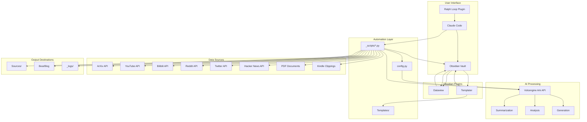

## System Architecture Diagram

This diagram shows the high-level architecture of your AI-powered Obsidian vault:

### 1. User Interface Layer
- **Obsidian**: Main knowledge base interface
- **Claude Code**: AI assistant for script execution and agent management
- **Ralph Loop Plugin**: Automated task execution system

### 2. Automation Layer
- **Scripts**: Python automation scripts for content acquisition and processing
- **Templates**: Note templates for consistency
- **Config**: Central configuration file

### 3. Data Sources
External content sources accessed by scripts:
- ArXiv, YouTube, Bilibili, Reddit, Twitter, Hacker News
- PDF documents, Kindle clippings

### 4. AI Processing Layer
Volcengine Ark API for:
- Content summarization
- Analysis and classification
- Text generation

### 5. Obsidian Plugins
- **Dataview**: Advanced query and relational database capabilities
- **Templater**: Note creation automation

### 6. Output Destinations
- **Sources/**: External content storage
- **BearBlog**: Publishing platform
- **_logs/**: Script execution logs

The system uses a bidirectional flow:
1. Content flows from sources → AI processing → Obsidian
2. Notes in Obsidian can be enhanced by AI
3. Automation scripts are controlled through Claude Code or Ralph Loop
4. Dataview and Templater provide enhanced usability

This architecture ensures that your knowledge base remains up-to-date, well-organized, and continuously improved through automation and AI assistance.
